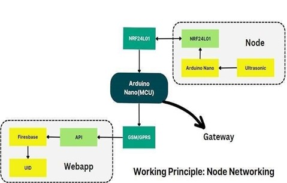
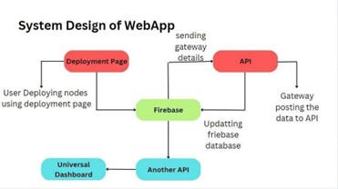
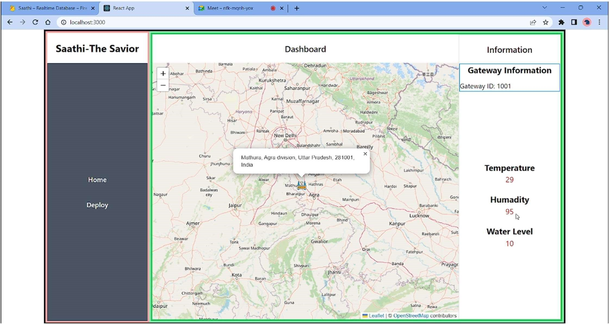
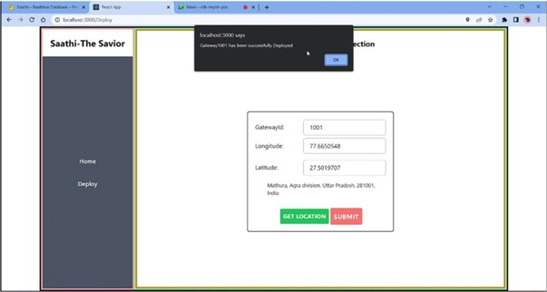
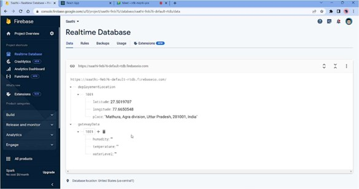
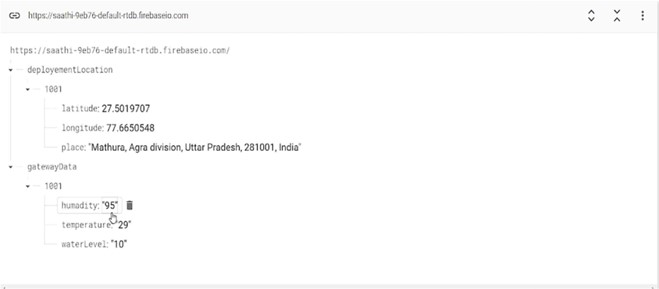

# Saathi The Savior - Flood Management Project Readme

The main goal of this project is to address the challenges posed by floods in India by examining the current situation and exploring innovative solutions to reduce the impact of future floods. Through comprehensive research and analysis, the project aims to provide recommendations for the development of effective flood management strategies that utilize the latest technologies and systems. The ultimate objective is to contribute to the reduction of flood impacts in India and ensure a more resilient future for its citizens.

## Project Ideology

The ideology behind the project primarily revolves around:

- Reducing the impact of floods.
- Developing effective flood management strategies.
- Enhancing usability and reducing costs.

The overarching intention of these tools is to pave the way for a more resilient future for the citizens of India.

## Project Overview

This project is focused on developing two vital tools for flood management in India:

- **Real-time Monitoring System:** This system will monitor water levels in rivers, city sewers, and detect water levels in cities during flood times. It will provide critical information for decision-making and disaster response.

- **Universal Information Dashboard:** The dashboard will offer real-time information in a visual format using maps, displaying essential data like water levels in rivers and city sewers. Accessible across all levels of administration, the dashboard aims to offer a comprehensive and up-to-date view of the flood situation, thereby enhancing decision-making and flood risk management.

Additionally, the project aims to collect a versatile dataset that can be used to develop an AI model for predicting the behavior of specific areas during future floods. The ultimate objective of these tools is to ensure a more resilient future for the citizens of India.

## Motivation

Having a system that can track river levels and provide timely warnings about potential flooding can enable effective response measures. The project's aim is not only to prevent floods but also to assist people in challenging situations and minimize losses. By being prepared in advance, the project can help manage food supply, water access for affected individuals, and minimize overall damage.

## Project Components

The project comprises two main components:

- **Hardware Component:** This involves designing a network of gateways and nodes to cover various water level points across the city and river sides. The collected data will be transmitted to an API over the internet using GSM modules.

- **Web Application Component:** The web application will display the collected data on a dashboard. It will provide a user-friendly interface to visualize and understand the flood situation.

## Technologies Used

### Front End

- **HTML:** Hypertext Markup Language is used for creating web pages and structuring content.

- **CSS:** Cascading Style Sheets are employed for managing web page layout and formatting.

- **JavaScript:** Client-side scripting language used for interactive effects, enhancing user experience, and handling user interactions.

- **React JS:** JavaScript library for building dynamic user interfaces with reusable components and efficient state management.

### API

- **Leaflet Map API:** Open source map API for integrating maps and location-based functionality into web applications.

- **RestAPI:** Used for collecting hardware data in JSON format and sending it to the cloud for storage and processing.

### Backend

- **Firebase:** Platform for developing and deploying web and mobile applications, offering real-time database, authentication, and hosting tools.

- **Flask:** Python micro web framework for building web applications with a simple and flexible structure.

# Functionality

## Real-Time Monitoring System

The Real-Time Monitoring System encompasses the following functionalities:

- **Water Level Monitoring:** Sensors strategically placed across rivers and city sewers collect real-time water level data.

- **Early Warning System:** The system analyzes incoming data and triggers early warnings if water levels exceed predefined thresholds, allowing authorities to take prompt action.

- **City Surveillance:** The system also detects rising water levels within city limits during flood events, enabling timely evacuation and resource allocation.

- **Data Aggregation:** Collected data from various nodes is aggregated and sent to the cloud-based API for storage and analysis.

## Universal Information Dashboard

The Universal Information Dashboard offers the following key features:

- **Real-Time Visualization:** The dashboard displays water levels from various sources on a user-friendly map interface in real-time.

- **Customizable Alerts:** Users can set custom alerts based on specific water level thresholds to receive notifications via email or SMS.

- **Historical Data Analysis:** The dashboard allows users to review historical data trends, aiding in post-flood analysis and future strategy development.

- **Multi-Level Access:** Different levels of administrators can access the dashboard, from local authorities to national disaster management agencies.

## AI Prediction Model

The AI Prediction Model contributes the following capabilities:

- **Data Training:** The model is trained using the collected dataset, considering variables such as rainfall, topography, and previous flooding patterns.

- **Predictive Insights:** Once trained, the model can provide predictive insights into how specific areas may behave during various flood scenarios.

- **Decision Support:** These predictions offer decision-makers valuable information for proactive planning, resource allocation, and response strategies.

- **Continuous Learning:** The model can be continuously improved by incorporating new data and validating predictions against actual events.

## User Engagement and Reporting

The system engages users through:

- **Citizen Reporting:** Citizens can report flood-related observations through the web application, contributing to real-time data collection.

- **Educational Resources:** The application provides educational resources and tips on flood preparedness and safety measures.

- **Feedback Loop:** Authorities can use citizen-reported data to validate system accuracy and address specific concerns.

# Web App Snapshot

    
    
    
    
    
    

## Project Demo Video

To get a better understanding of the Flood Management Project's features and functionality, you can watch the project demo video below:

[![Project Demo Video]](https://youtu.be/I3-5uqqEJ_k)

The video provides a visual walkthrough of the real-time monitoring system, universal information dashboard.
  
# Website Link

The web application for the Flood Management Project can be accessed at [https://your-website-link.com](https://645d0205a4a034243b41c865--transcendent-buttercream-7583c2.netlify.app/). The application provides a user-friendly interface to access real-time flood data, visualize water levels on maps, set alerts, and engage in citizen reporting.

## Conclusion

This project aims to contribute to flood management in India through a comprehensive approach involving real-time monitoring, information visualization, and AI prediction models. By leveraging advanced technologies and systems, the project endeavors to reduce the impact of floods and create a more resilient future for the citizens of India.

## Credits

This project was developed by Kamal Soni and Mukul Agrawal.
  
## Contact

Feel free to reach out to webdevkamal@gmail.com with any questions or inquiries.

